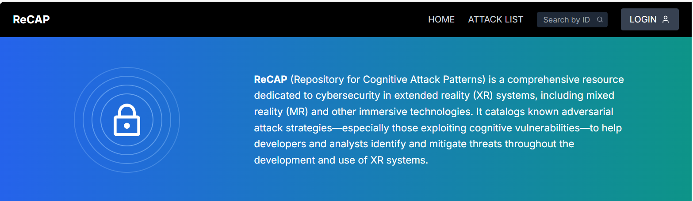

# 🧠 Repository of Cognitive Attack Patterns (ReCAP)

**Advancing Cognitive Security in Extended Reality (XR) Systems**

---

## 🔍 Overview

The **Repository of Cognitive Attack Patterns (ReCAP)** is a publicly accessible resource developed by **Collins Aerospace** as part of the **Modeling and Analysis Toolkit for Realizable Intrinsic Cognitive Security (MATRICS)**, under DARPA’s **Intrinsic Cognitive Security (ICS)** program. ReCAP serves as an online knowledge base designed to enable the structured documentation, analysis, and dissemination of **cognitive attacks**, **vulnerabilities**, and **mitigation strategies** specific to **extended reality (XR)** systems.

---

## 🛡️ Purpose and Capabilities

ReCAP enables researchers, system developers, and security analysts to:

- Contribute to a structured, evolving **taxonomy of cognitive attacks, defensed and vulnerabilities**.
- Identify and analyze **cognitive attack patterns** in XR and mixed-reality systems.
- Explore relationships among **attacks**, **vulnerabilities**, **mitigations**, and **assurance arguments**.
- Support the elicitation of **cognitive security guarantees** during system design and evaluation.

The repository includes both published cognitive attack patterns and new patterns discovered through ongoing research in immersive technologies.

---

## 🚧 Current Status

ReCAP is **currently under construction and testing**.

The initial release will feature:

- A validated **cognitive attack classification schema**
- An **interactive user interface** for browsing and contributing attack patterns
- Reference links to supporting research and documentation
- Collaboration tools for the research and practitioner community

**Availability:**  The website will be available soon at the following URL:
🌐 [Web Address]

---

## 🤝 Community Involvement

Contributions from the broader research community are highly encouraged to ensure ReCAP’s accuracy, relevance, and utility.

Community participation will help:

- Refine and expand the cognitive attack taxonomy
- Populate the knowledge base with **real-world case studies**
- Foster consensus on representing and analyzing **cognitive security** in XR systems

---

## 🔎 Transparency and Traceability

ReCAP emphasizes **evidence-based security** through:

- Clear reference links to **academic publications**, **technical reports**, and **empirical studies**
- Documentation of the source and rationale behind each attack pattern and mitigation

This ensures **traceability**, **transparency**, and **reproducibility** in the development of cognitive security frameworks.

---

## 📬 Stay Informed

For updates, contributions, or early access requests, please contact:

📧 Heber.Herencia-Zapana@collins.com

---

© 2025 Collins Aerospace. All rights reserved.
